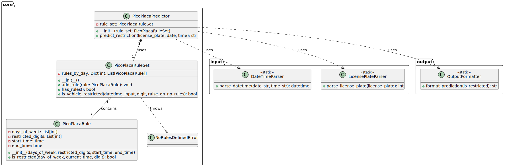

# PicoPlaca

A command-line tool to check if a vehicle is restricted from circulation according to the "Pico y Placa" traffic regulations in Ecuador.

## Description

PicoPlaca is a Python CLI application that helps users determine whether a vehicle with a specific license plate number is allowed to circulate on a given date and time according to the "Pico y Placa" traffic restriction policy in Ecuador. This policy aims to reduce traffic congestion during peak hours by restricting vehicles from circulating based on the last digit of their license plates on specific days and during designated time periods.

### Rules Implemented

The current implementation follows these restriction rules:

| Day of Week | Restricted License Plate Last Digits | Restricted Hours           |
|-------------|--------------------------------------|----------------------------|
| Monday      | 1, 2                                | 06:00-09:30 and 16:00-20:00 |
| Tuesday     | 3, 4                                | 06:00-09:30 and 16:00-20:00 |
| Wednesday   | 5, 6                                | 06:00-09:30 and 16:00-20:00 |
| Thursday    | 7, 8                                | 06:00-09:30 and 16:00-20:00 |
| Friday      | 9, 0                                | 06:00-09:30 and 16:00-20:00 |
| Weekend     | No restrictions                     | No restrictions            |

## Installation

Clone the repository to your local machine:

```bash
git clone https://github.com/Alejololer/PicoPlaca.git
cd PicoPlaca
```

## Usage

### Prerequisites

- Python 3.6 or higher

### Basic Command

In the root directory of the project:

```
python cli.py --plate XXX-#### [--date YYYY-MM-DD] [--time HH:MM]
```

### Parameters

- `-p, --plate`: The license plate number in format XXX-#### or XXX-### (required)
- `-d, --date`: Date to check in format YYYY-MM-DD (defaults to today)
- `-t, --time`: Time to check in format HH:MM (defaults to current time)
- `-h, --help`: Show help message and exit

### Examples

Check if a vehicle is restricted right now:
```
python cli.py --plate ABC-1234
```

Check for a specific date and time:
```
python cli.py --plate XYZ-567 --date 2023-12-01 --time 08:30
```

## Project Structure

The application is organized into the following modules:

- `core/`: Core functionality and business logic
  - `pico_placa_rule.py`: Defines individual restriction rules
  - `pico_placa_rule_set.py`: Manages collections of rules
  - `pico_placa_predictor.py`: Provides the main prediction functionality
- `input/`: Input handling and validation
  - `license_plate_parser.py`: Validates and parses license plates
  - `date_time_parser.py`: Validates and parses date and time inputs
- `output/`: Output formatting
  - `output_formatter.py`: Formats prediction results
- `cli.py`: Command-line interface

## Testing

The project includes a comprehensive test suite to ensure reliability and correctness.

### Running Tests

To run all tests:

```bash
python -m unittest discover -s tests
```

To run a specific test module:

```bash
python -m unittest tests.test_core
python -m unittest tests.test_input
python -m unittest tests.test_output
python -m unittest tests.test_end_to_end
```

### Test Structure

- `test_core.py`: Unit tests for the core components (PicoPlacaRule, PicoPlacaRuleSet, PicoPlacaPredictor)
- `test_input.py`: Unit tests for input parsing (DateTimeParser, LicensePlateParser)
- `test_output.py`: Unit tests for output formatting (OutputFormatter)
- `test_end_to_end.py`: End-to-end tests that validate the entire system with real components

### Test Coverage

Tests cover various scenarios including:
- Valid and invalid license plates
- Boundary time conditions
- Weekend vs. weekday restrictions
- Error handling
- Edge cases

### Class Diagram

